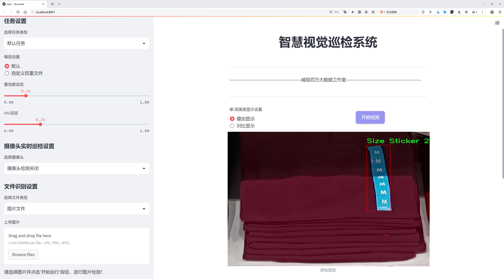
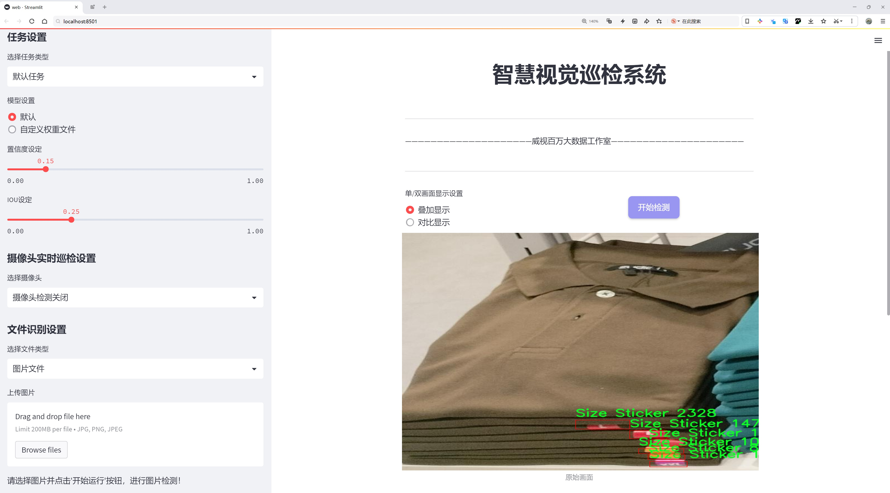
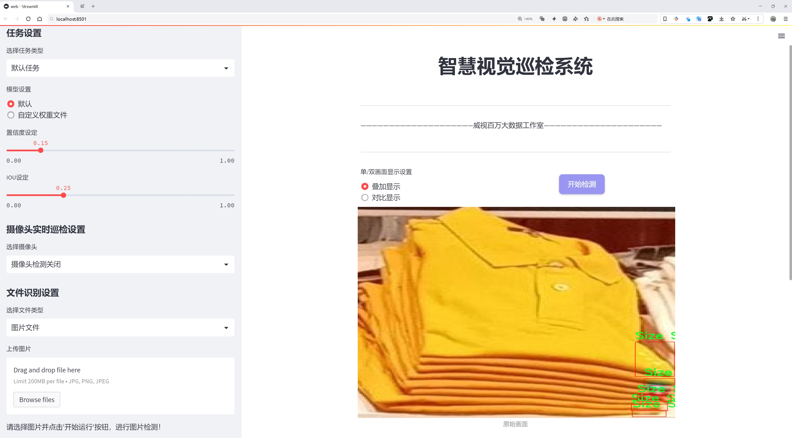
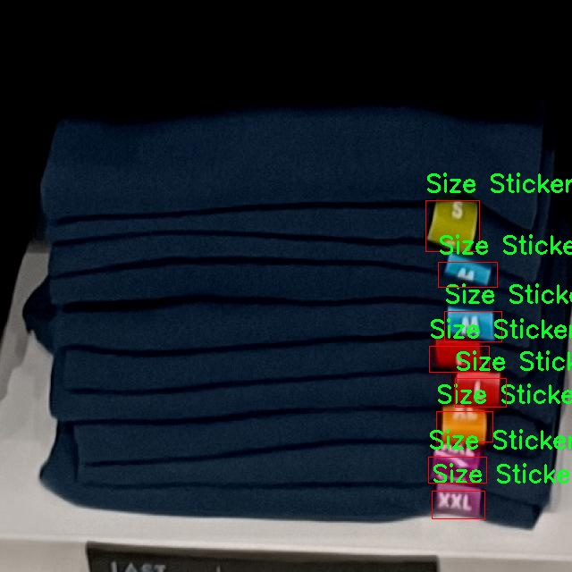
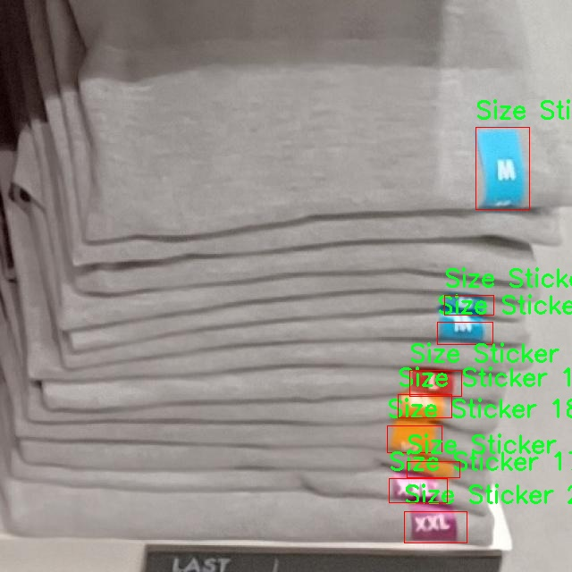
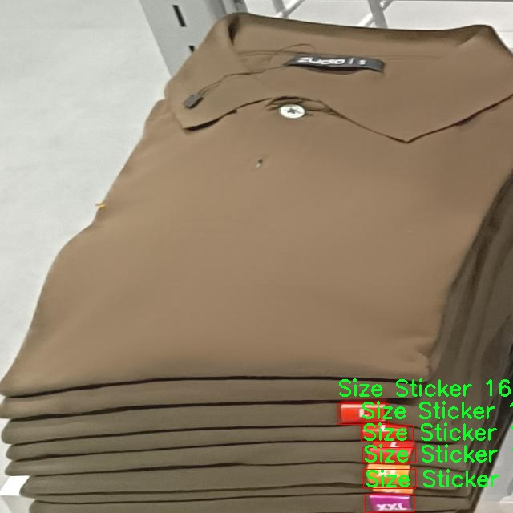
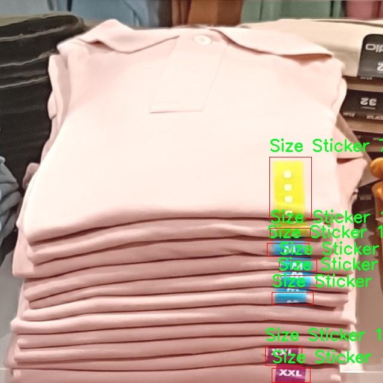

# 物品堆叠检测检测系统源码分享
 # [一条龙教学YOLOV8标注好的数据集一键训练_70+全套改进创新点发刊_Web前端展示]

### 1.研究背景与意义

项目参考[AAAI Association for the Advancement of Artificial Intelligence](https://gitee.com/qunmasj/projects)

项目来源[AACV Association for the Advancement of Computer Vision](https://github.com/qunshansj/good)

研究背景与意义

随着智能化技术的迅速发展，物体检测技术在各个领域中得到了广泛应用，尤其是在物流、仓储、制造等行业。物品堆叠检测作为物体检测中的一个重要分支，具有重要的实际意义。传统的物体检测方法在处理复杂场景时往往面临着准确性不足和实时性差的问题。近年来，YOLO（You Only Look Once）系列模型因其高效的检测速度和良好的准确性而受到广泛关注。YOLOv8作为该系列的最新版本，进一步提升了模型的性能，成为研究的热点。然而，现有的YOLOv8模型在处理物品堆叠这一特定任务时，仍然存在一些挑战，如对重叠物体的识别能力不足、对不同堆叠方式的适应性差等。因此，基于改进YOLOv8的物品堆叠检测系统的研究显得尤为重要。

本研究基于SS_Labeling数据集，该数据集包含3298张图像，涵盖了三类物体：尺寸贴纸、堆叠物体和堆叠组合。这些数据不仅为模型的训练提供了丰富的样本，也为物品堆叠检测的研究提供了良好的基础。通过对该数据集的深入分析，我们可以识别出物品堆叠过程中的关键特征，从而为改进YOLOv8模型提供数据支持。此外，数据集中包含的多样化样本使得模型能够在不同的环境和条件下进行训练，提高了其泛化能力。

在实际应用中，物品堆叠检测系统的高效性和准确性直接影响到物流和仓储管理的效率。通过改进YOLOv8模型，我们可以实现对堆叠物体的快速、准确检测，从而优化仓储空间的利用，降低人力成本，提高工作效率。同时，该系统的应用也能够减少人为错误，提高物品管理的智能化水平，推动行业的数字化转型。

此外，物品堆叠检测技术的进步也将为相关领域的研究提供新的思路和方法。随着深度学习技术的不断发展，物体检测的应用场景将不断扩展。通过对YOLOv8模型的改进，我们不仅可以提升物品堆叠检测的性能，还可以为其他复杂场景下的物体检测提供借鉴和参考。这将有助于推动计算机视觉技术在更广泛领域的应用，促进相关技术的进步与发展。

综上所述，基于改进YOLOv8的物品堆叠检测系统的研究，不仅具有重要的理论意义，也具备广泛的实际应用价值。通过深入探讨该领域的关键问题，我们期望能够为物品堆叠检测技术的发展提供新的思路和解决方案，推动相关行业的智能化进程，为实现更高效的物品管理和物流服务贡献力量。

### 2.图片演示







##### 注意：由于此博客编辑较早，上面“2.图片演示”和“3.视频演示”展示的系统图片或者视频可能为老版本，新版本在老版本的基础上升级如下：（实际效果以升级的新版本为准）

  （1）适配了YOLOV8的“目标检测”模型和“实例分割”模型，通过加载相应的权重（.pt）文件即可自适应加载模型。

  （2）支持“图片识别”、“视频识别”、“摄像头实时识别”三种识别模式。

  （3）支持“图片识别”、“视频识别”、“摄像头实时识别”三种识别结果保存导出，解决手动导出（容易卡顿出现爆内存）存在的问题，识别完自动保存结果并导出到tempDir中。

  （4）支持Web前端系统中的标题、背景图等自定义修改，后面提供修改教程。

  另外本项目提供训练的数据集和训练教程,暂不提供权重文件（best.pt）,需要您按照教程进行训练后实现图片演示和Web前端界面演示的效果。

### 3.视频演示

[3.1 视频演示](https://www.bilibili.com/video/BV18FHpeZEPk/?vd_source=ff015de2d29cbe2a9cdbfa7064407a08)

### 4.数据集信息展示

##### 4.1 本项目数据集详细数据（类别数＆类别名）

nc: 1
names: ['Size Sticker']


##### 4.2 本项目数据集信息介绍

数据集信息展示

在本研究中，我们使用了名为“SS_Labeling”的数据集，旨在改进YOLOv8的物品堆叠检测系统。该数据集专注于特定类别的物品识别，提供了丰富的标注信息，极大地支持了深度学习模型的训练与优化。数据集的类别数量为1，具体类别为“Size Sticker”。这一类别的选择反映了我们在物品堆叠检测中的实际应用需求，尤其是在仓储管理、物流配送以及零售环境中，准确识别和分类尺寸标签对于提升工作效率和减少错误至关重要。

“SS_Labeling”数据集的构建过程经过了精心设计，确保了数据的多样性和代表性。数据集中包含了大量的图像样本，这些样本涵盖了不同环境、光照条件和物品堆叠方式下的“Size Sticker”。通过这种多样化的样本选择，模型能够更好地学习到不同情况下的特征，从而提高其在实际应用中的鲁棒性和准确性。此外，数据集中的图像经过专业标注，确保了每个“Size Sticker”的位置和类别信息的准确性，为YOLOv8模型的训练提供了高质量的输入。

在数据预处理阶段，我们对图像进行了标准化处理，以确保输入数据的一致性。这包括调整图像的尺寸、归一化像素值以及数据增强等步骤。数据增强技术的应用，例如随机裁剪、旋转和亮度调整，进一步丰富了训练样本的多样性，使得模型在面对未知数据时能够更具适应性。通过这些预处理和增强手段，我们希望能够有效提升YOLOv8在物品堆叠检测任务中的性能。

为了评估模型的训练效果，我们将数据集划分为训练集和验证集。训练集用于模型的学习，而验证集则用于实时监测模型的性能，以防止过拟合现象的发生。通过不断迭代训练和验证，我们能够优化模型的参数，确保其在实际应用中的可靠性和准确性。

在训练过程中，我们还引入了多种评价指标，如平均精度均值（mAP）和召回率等，以全面评估模型的检测能力。这些指标不仅帮助我们量化模型的性能，还为后续的模型调整和优化提供了重要依据。通过对“SS_Labeling”数据集的深入分析与研究，我们期望能够推动物品堆叠检测技术的发展，提升相关行业的自动化水平和工作效率。

总之，“SS_Labeling”数据集为改进YOLOv8的物品堆叠检测系统提供了坚实的基础。通过高质量的标注数据和精心设计的训练流程，我们相信该研究将为物品识别领域带来新的突破，为未来的应用场景奠定良好的基础。










### 5.全套项目环境部署视频教程（零基础手把手教学）

[5.1 环境部署教程链接（零基础手把手教学）](https://www.ixigua.com/7404473917358506534?logTag=c807d0cbc21c0ef59de5)


[5.2 安装Python虚拟环境创建和依赖库安装视频教程链接（零基础手把手教学）](https://www.ixigua.com/7404474678003106304?logTag=1f1041108cd1f708b01a)

### 6.手把手YOLOV8训练视频教程（零基础小白有手就能学会）

[6.1 环境部署教程链接（零基础手把手教学）](https://www.ixigua.com/7404477157818401292?logTag=d31a2dfd1983c9668658)

### 7.70+种全套YOLOV8创新点代码加载调参视频教程（一键加载写好的改进模型的配置文件）

[7.1 环境部署教程链接（零基础手把手教学）](https://www.ixigua.com/7404478314661806627?logTag=29066f8288e3f4eea3a4)

### 8.70+种全套YOLOV8创新点原理讲解（非科班也可以轻松写刊发刊，V10版本正在科研待更新）

由于篇幅限制，每个创新点的具体原理讲解就不一一展开，具体见下列网址中的创新点对应子项目的技术原理博客网址【Blog】：


[8.1 70+种全套YOLOV8创新点原理讲解链接](https://gitee.com/qunmasj/good)

### 9.系统功能展示（检测对象为举例，实际内容以本项目数据集为准）

图9.1.系统支持检测结果表格显示

  图9.2.系统支持置信度和IOU阈值手动调节

  图9.3.系统支持自定义加载权重文件best.pt(需要你通过步骤5中训练获得)

  图9.4.系统支持摄像头实时识别

  图9.5.系统支持图片识别

  图9.6.系统支持视频识别

  图9.7.系统支持识别结果文件自动保存

  图9.8.系统支持Excel导出检测结果数据


### 10.原始YOLOV8算法原理

原始YOLOv8算法原理

YOLO（You Only Look Once）系列算法自问世以来，凭借其高效的目标检测能力和实时性，逐渐成为计算机视觉领域的重要工具。YOLOv8作为该系列的最新版本，在算法架构和性能上进行了诸多创新与优化，进一步提升了目标检测的精度和速度。YOLOv8的设计理念依然秉承了YOLO系列一贯的单阶段检测思路，旨在通过简化模型结构和优化特征提取过程，实现高效的目标检测。

YOLOv8的网络结构主要由四个核心部分组成：输入层、Backbone（主干网络）、Neck（特征融合网络）和Head（检测模块）。在输入层，YOLOv8首先对输入图像进行预处理，包括调整图像比例、应用Mosaic增强等。这些预处理步骤不仅提升了模型对不同场景的适应能力，还为后续的特征提取打下了良好的基础。

在Backbone部分，YOLOv8延续了DarkNet结构的设计思路，但在具体实现上进行了重要的改进。与以往版本不同，YOLOv8采用了C2f模块替代了传统的C3模块。C2f模块的设计充分考虑了梯度流动的丰富性，通过增加残差连接，增强了模型在特征提取过程中的信息传递能力。这种设计使得YOLOv8在保持轻量化特性的同时，能够获取更为丰富的特征信息，从而提高了目标检测的准确性。

接下来，特征融合网络Neck部分依然采用了双塔结构，结合了特征金字塔网络（FPN）和路径聚合网络（PAN）。这种结构的设计旨在促进语义特征与定位特征之间的有效转移，进一步增强了网络的特征融合能力。通过这种方式，YOLOv8能够更好地处理不同尺度的目标，提升对小目标和大目标的检测性能。

在Head模块中，YOLOv8引入了流行的解耦合头结构，将分类和回归任务分离开来。这一创新使得模型在处理目标检测时能够更加高效地进行分类和定位，避免了传统方法中分类和回归任务相互干扰的问题。此外，YOLOv8还将Anchor-Based检测方法替换为Anchor-Free策略，这一转变使得模型在面对复杂场景时，能够更加灵活地适应不同的目标形状和大小。

YOLOv8在训练过程中也采用了一系列先进的数据增强技术。例如，在训练的最后10个epoch中，模型关闭了Mosaic增强，并引入了动态的Task-Aligned Assigner样本分配策略。这种策略能够根据任务的需求动态调整样本的分配，提高了训练的效率和效果。同时，在损失计算方面，YOLOv8采用了BCELoss作为分类损失，DFLLoss和CIoULoss作为回归损失，这种多样化的损失函数设计使得模型在优化过程中能够更好地平衡分类和回归的精度。

总的来说，YOLOv8在多个方面对原有YOLO系列算法进行了创新与优化，使得其在目标检测任务中展现出更强的性能。通过改进的Backbone、特征融合网络和解耦合头结构，YOLOv8不仅提高了检测精度，还显著提升了模型的推理速度。这些创新使得YOLOv8在实时性要求高的应用场景中，成为了一个理想的选择。无论是在自动驾驶、安防监控，还是在工业检测等领域，YOLOv8都展现出了广泛的应用潜力和良好的市场前景。


### 11.项目核心源码讲解（再也不用担心看不懂代码逻辑）

#### 11.1 ultralytics\models\yolo\obb\train.py

以下是经过简化和注释的核心代码部分，保留了主要功能并进行了详细的中文注释：

```python
# 导入必要的库和模块
from copy import copy
from ultralytics.models import yolo
from ultralytics.nn.tasks import OBBModel
from ultralytics.utils import DEFAULT_CFG, RANK

class OBBTrainer(yolo.detect.DetectionTrainer):
    """
    OBBTrainer类，扩展了DetectionTrainer类，用于基于定向边界框（OBB）模型的训练。
    
    示例用法：
        ```python
        from ultralytics.models.yolo.obb import OBBTrainer

        args = dict(model='yolov8n-seg.pt', data='coco8-seg.yaml', epochs=3)
        trainer = OBBTrainer(overrides=args)
        trainer.train()
        ```
    """

    def __init__(self, cfg=DEFAULT_CFG, overrides=None, _callbacks=None):
        """初始化OBBTrainer对象，接受配置和覆盖参数。"""
        if overrides is None:
            overrides = {}
        overrides["task"] = "obb"  # 设置任务类型为OBB
        super().__init__(cfg, overrides, _callbacks)  # 调用父类构造函数

    def get_model(self, cfg=None, weights=None, verbose=True):
        """返回初始化的OBBModel模型，使用指定的配置和权重。"""
        # 创建OBBModel实例，通道数为3，类别数为数据集中类别的数量
        model = OBBModel(cfg, ch=3, nc=self.data["nc"], verbose=verbose and RANK == -1)
        if weights:
            model.load(weights)  # 如果提供了权重，则加载权重

        return model  # 返回模型实例

    def get_validator(self):
        """返回OBBValidator实例，用于YOLO模型的验证。"""
        self.loss_names = "box_loss", "cls_loss", "dfl_loss"  # 定义损失名称
        # 创建并返回OBBValidator实例
        return yolo.obb.OBBValidator(self.test_loader, save_dir=self.save_dir, args=copy(self.args))
```

### 代码说明：
1. **导入模块**：引入必要的库和模块以支持模型训练和验证。
2. **OBBTrainer类**：继承自`DetectionTrainer`，用于训练定向边界框模型。
3. **构造函数**：初始化时设置任务类型为OBB，并调用父类的构造函数。
4. **get_model方法**：创建并返回一个OBB模型实例，支持加载预训练权重。
5. **get_validator方法**：返回一个验证器实例，用于评估模型性能，定义了损失名称以便后续分析。

通过这些核心部分和注释，可以清晰地理解OBBTrainer类的功能和结构。

该文件是一个用于训练基于定向边界框（OBB）模型的YOLO（You Only Look Once）算法的训练器类`OBBTrainer`的实现。该类继承自`DetectionTrainer`，并对其进行了扩展，以支持OBB模型的训练。

在文件的开头，导入了一些必要的模块和类，包括`copy`模块、YOLO模型相关的模块、OBB模型类以及一些工具函数和常量。接着，定义了`OBBTrainer`类，并在类文档字符串中给出了该类的简要说明和使用示例。示例展示了如何创建`OBBTrainer`的实例并调用其`train`方法进行训练。

构造函数`__init__`用于初始化`OBBTrainer`对象。它接受三个参数：`cfg`（配置文件，默认为`DEFAULT_CFG`）、`overrides`（用于覆盖默认配置的字典，默认为`None`）和`_callbacks`（回调函数，默认为`None`）。在构造函数中，如果`overrides`为`None`，则初始化为空字典，并将任务类型设置为“obb”。然后，调用父类的构造函数进行初始化。

`get_model`方法用于返回一个初始化的`OBBModel`实例。该方法接受三个参数：`cfg`（配置文件）、`weights`（权重文件）和`verbose`（是否打印详细信息，默认为`True`）。在方法内部，创建一个`OBBModel`对象，并根据传入的权重文件加载模型权重。

`get_validator`方法返回一个`OBBValidator`实例，用于验证YOLO模型的性能。在该方法中，定义了损失名称，包括“box_loss”、“cls_loss”和“dfl_loss”，并返回一个`OBBValidator`对象，传入测试数据加载器、保存目录和参数的副本。

总的来说，这个文件定义了一个专门用于训练OBB模型的训练器类，提供了模型初始化和验证的功能，使得用户能够方便地进行OBB模型的训练和评估。

#### 11.2 ui.py

```python
import sys
import subprocess

def run_script(script_path):
    """
    使用当前 Python 环境运行指定的脚本。

    Args:
        script_path (str): 要运行的脚本路径

    Returns:
        None
    """
    # 获取当前 Python 解释器的路径
    python_path = sys.executable

    # 构建运行命令，使用 streamlit 运行指定的脚本
    command = f'"{python_path}" -m streamlit run "{script_path}"'

    # 执行命令
    result = subprocess.run(command, shell=True)
    # 检查命令执行结果，如果返回码不为0，表示出错
    if result.returncode != 0:
        print("脚本运行出错。")

# 实例化并运行应用
if __name__ == "__main__":
    # 指定要运行的脚本路径
    script_path = "web.py"  # 这里可以直接指定脚本名

    # 运行脚本
    run_script(script_path)
```

### 代码核心部分注释：
1. **导入模块**：
   - `sys`：用于获取当前 Python 解释器的路径。
   - `subprocess`：用于执行外部命令。

2. **`run_script` 函数**：
   - 该函数接受一个脚本路径作为参数，并使用当前 Python 环境运行该脚本。
   - 使用 `sys.executable` 获取当前 Python 解释器的路径。
   - 构建一个命令字符串，使用 `streamlit` 模块运行指定的脚本。
   - 使用 `subprocess.run` 执行构建的命令，并检查执行结果。如果返回码不为0，表示脚本运行出错。

3. **主程序入口**：
   - 在 `if __name__ == "__main__":` 块中，指定要运行的脚本路径，并调用 `run_script` 函数执行该脚本。

这个程序文件的主要功能是使用当前的 Python 环境来运行一个指定的脚本，具体来说是运行一个名为 `web.py` 的脚本。程序首先导入了必要的模块，包括 `sys`、`os` 和 `subprocess`，这些模块提供了与系统交互和执行外部命令的功能。此外，还导入了 `abs_path` 函数，用于获取脚本的绝对路径。

在 `run_script` 函数中，首先获取当前 Python 解释器的路径，这通过 `sys.executable` 实现。接着，构建一个命令字符串，该命令用于调用 `streamlit` 运行指定的脚本。这里使用了 `-m` 参数来指定模块，确保可以正确执行 `streamlit`。

随后，使用 `subprocess.run` 函数来执行构建好的命令。这个函数会在一个新的 shell 中运行命令，并等待其完成。如果命令执行的返回码不为零，表示脚本运行出错，程序会输出相应的错误信息。

在文件的最后部分，使用 `if __name__ == "__main__":` 来判断当前模块是否是主程序。如果是，则指定要运行的脚本路径为 `web.py` 的绝对路径，并调用 `run_script` 函数来执行这个脚本。

总体来说，这个程序的设计目的是为了方便地在当前 Python 环境中运行一个 Streamlit 应用，确保用户能够轻松启动指定的 Web 应用脚本。

#### 11.3 ultralytics\utils\downloads.py

以下是代码中最核心的部分，并附上详细的中文注释：

```python
import requests
from pathlib import Path
from zipfile import ZipFile, is_zipfile
from ultralytics.utils import LOGGER, TQDM

def safe_download(
    url,
    file=None,
    dir=None,
    unzip=True,
    delete=False,
    retry=3,
    min_bytes=1e0,
    exist_ok=False,
    progress=True,
):
    """
    从指定的 URL 下载文件，并提供重试、解压和删除下载文件的选项。

    参数:
        url (str): 要下载的文件的 URL。
        file (str, optional): 下载文件的文件名。如果未提供，将使用 URL 的文件名。
        dir (str, optional): 保存下载文件的目录。如果未提供，将保存在当前工作目录中。
        unzip (bool, optional): 是否在下载后解压文件。默认为 True。
        delete (bool, optional): 是否在解压后删除下载的文件。默认为 False。
        retry (int, optional): 下载失败时重试的次数。默认为 3。
        min_bytes (float, optional): 下载文件被视为成功下载所需的最小字节数。默认为 1E0。
        exist_ok (bool, optional): 解压时是否覆盖现有内容。默认为 False。
        progress (bool, optional): 下载过程中是否显示进度条。默认为 True。

    返回:
        (Path): 解压后的目录路径。
    """
    f = Path(dir or ".") / (file or url2file(url))  # 根据提供的目录和文件名生成文件路径
    if not f.is_file():  # 如果文件不存在
        desc = f"Downloading {url} to '{f}'"
        LOGGER.info(f"{desc}...")
        f.parent.mkdir(parents=True, exist_ok=True)  # 创建目录
        for i in range(retry + 1):  # 尝试下载
            try:
                # 使用 requests 下载文件
                with requests.get(url, stream=True) as response:
                    response.raise_for_status()  # 检查请求是否成功
                    with open(f, "wb") as f_opened:
                        for data in response.iter_content(chunk_size=8192):
                            f_opened.write(data)  # 写入文件
                if f.exists() and f.stat().st_size > min_bytes:  # 检查文件大小
                    break  # 下载成功
            except Exception as e:
                if i >= retry:  # 达到重试次数
                    raise ConnectionError(f"下载失败: {url}") from e
                LOGGER.warning(f"⚠️ 下载失败，正在重试 {i + 1}/{retry} {url}...")

    # 解压文件
    if unzip and f.exists() and f.suffix in (".zip", ".tar", ".gz"):
        unzip_dir = dir or f.parent  # 解压到指定目录或当前目录
        if is_zipfile(f):
            with ZipFile(f) as zipObj:
                zipObj.extractall(unzip_dir)  # 解压所有文件
        if delete:
            f.unlink()  # 删除压缩文件
        return unzip_dir  # 返回解压目录路径
```

### 代码说明：
1. **导入必要的库**：导入 `requests` 用于网络请求，`Path` 用于文件路径操作，`ZipFile` 用于处理压缩文件，`LOGGER` 用于日志记录，`TQDM` 用于显示进度条。

2. **`safe_download` 函数**：该函数负责从指定的 URL 下载文件，并提供多种选项，如解压、删除和重试机制。

3. **参数处理**：
   - 生成文件路径 `f`，如果未提供文件名，则从 URL 中提取。
   - 如果文件不存在，则开始下载。

4. **下载逻辑**：
   - 使用 `requests.get` 进行下载，支持流式下载以处理大文件。
   - 在下载过程中，如果出现异常，则根据重试次数进行重试。

5. **解压逻辑**：
   - 下载完成后，如果文件是压缩文件（如 `.zip`、`.tar`、`.gz`），则进行解压。
   - 如果设置了 `delete`，则在解压后删除压缩文件。

6. **返回值**：返回解压后的目录路径，便于后续操作。

这个程序文件`ultralytics/utils/downloads.py`主要用于处理文件的下载、解压和管理，特别是与Ultralytics YOLO模型相关的资源。文件中包含了一系列函数，功能涵盖了URL验证、文件删除、压缩与解压、磁盘空间检查、Google Drive文件信息获取、文件下载等。

首先，文件导入了一些必要的库，包括处理路径的`Path`、进行网络请求的`requests`、以及用于多线程下载的`ThreadPool`等。接着，定义了一些与Ultralytics GitHub资源相关的常量，包括模型文件的名称和路径。

函数`is_url`用于验证给定字符串是否为有效的URL，并可选择性地检查该URL是否在线。`delete_dsstore`函数则专门用于删除特定目录下的`.DS_Store`文件，这些文件是macOS系统生成的隐藏文件，可能在不同操作系统间传输时造成问题。

`zip_directory`和`unzip_file`函数分别用于压缩和解压目录，支持排除特定文件，并在操作时提供进度条。`check_disk_space`函数检查下载文件所需的磁盘空间是否充足，避免因空间不足导致下载失败。

获取Google Drive文件信息的`get_google_drive_file_info`函数可以提取分享链接中的直接下载链接和文件名，方便后续下载。`safe_download`函数是下载的核心，支持从URL下载文件，提供重试机制、解压选项、删除下载文件的选项等，确保下载过程的可靠性。

`get_github_assets`和`attempt_download_asset`函数用于从GitHub获取特定版本的资源，尝试下载本地不存在的文件。最后，`download`函数则是一个高层次的接口，支持单个或多个URL的下载，并可通过多线程加速下载过程。

整体而言，这个文件为Ultralytics YOLO模型的使用者提供了强大的文件管理和下载功能，简化了模型资源的获取过程。

#### 11.4 ultralytics\nn\modules\transformer.py

以下是代码中最核心的部分，并附上详细的中文注释：

```python
import torch
import torch.nn as nn
import torch.nn.functional as F

class TransformerEncoderLayer(nn.Module):
    """定义一个Transformer编码器层。"""

    def __init__(self, c1, cm=2048, num_heads=8, dropout=0.0, act=nn.GELU(), normalize_before=False):
        """初始化TransformerEncoderLayer，设置参数。"""
        super().__init__()
        self.ma = nn.MultiheadAttention(c1, num_heads, dropout=dropout, batch_first=True)
        # 前馈网络的线性层
        self.fc1 = nn.Linear(c1, cm)
        self.fc2 = nn.Linear(cm, c1)

        self.norm1 = nn.LayerNorm(c1)  # 第一个归一化层
        self.norm2 = nn.LayerNorm(c1)  # 第二个归一化层
        self.dropout = nn.Dropout(dropout)  # dropout层
        self.dropout1 = nn.Dropout(dropout)  # 第一个dropout层
        self.dropout2 = nn.Dropout(dropout)  # 第二个dropout层

        self.act = act  # 激活函数
        self.normalize_before = normalize_before  # 是否在前面进行归一化

    def forward_post(self, src, src_mask=None, src_key_padding_mask=None, pos=None):
        """后归一化的前向传播。"""
        q = k = self.with_pos_embed(src, pos)  # 计算查询和键
        src2 = self.ma(q, k, value=src, attn_mask=src_mask, key_padding_mask=src_key_padding_mask)[0]  # 自注意力计算
        src = src + self.dropout1(src2)  # 残差连接
        src = self.norm1(src)  # 归一化
        src2 = self.fc2(self.dropout(self.act(self.fc1(src))))  # 前馈网络
        src = src + self.dropout2(src2)  # 残差连接
        return self.norm2(src)  # 返回归一化后的结果

    def forward(self, src, src_mask=None, src_key_padding_mask=None, pos=None):
        """前向传播，选择归一化方式。"""
        if self.normalize_before:
            return self.forward_pre(src, src_mask, src_key_padding_mask, pos)
        return self.forward_post(src, src_mask, src_key_padding_mask, pos)

class MSDeformAttn(nn.Module):
    """多尺度可变形注意力模块。"""

    def __init__(self, d_model=256, n_levels=4, n_heads=8, n_points=4):
        """初始化多尺度可变形注意力模块。"""
        super().__init__()
        self.d_model = d_model  # 模型维度
        self.n_levels = n_levels  # 层数
        self.n_heads = n_heads  # 注意力头数
        self.n_points = n_points  # 每个头的点数

        # 定义线性层
        self.sampling_offsets = nn.Linear(d_model, n_heads * n_levels * n_points * 2)
        self.attention_weights = nn.Linear(d_model, n_heads * n_levels * n_points)
        self.value_proj = nn.Linear(d_model, d_model)
        self.output_proj = nn.Linear(d_model, d_model)

    def forward(self, query, refer_bbox, value, value_shapes, value_mask=None):
        """执行多尺度可变形注意力的前向传播。"""
        bs, len_q = query.shape[:2]  # 批量大小和查询长度
        value = self.value_proj(value)  # 对值进行线性变换
        if value_mask is not None:
            value = value.masked_fill(value_mask[..., None], float(0))  # 应用掩码
        value = value.view(bs, -1, self.n_heads, self.d_model // self.n_heads)  # 重新排列值的形状
        sampling_offsets = self.sampling_offsets(query).view(bs, len_q, self.n_heads, self.n_levels, self.n_points, 2)  # 计算采样偏移
        attention_weights = self.attention_weights(query).view(bs, len_q, self.n_heads, self.n_levels * self.n_points)  # 计算注意力权重
        attention_weights = F.softmax(attention_weights, -1).view(bs, len_q, self.n_heads, self.n_levels, self.n_points)  # 归一化注意力权重

        # 计算采样位置
        sampling_locations = refer_bbox[:, :, None, :, None, :] + sampling_offsets  # 计算采样位置
        output = multi_scale_deformable_attn_pytorch(value, value_shapes, sampling_locations, attention_weights)  # 多尺度可变形注意力计算
        return self.output_proj(output)  # 返回输出

class DeformableTransformerDecoderLayer(nn.Module):
    """可变形Transformer解码器层。"""

    def __init__(self, d_model=256, n_heads=8, d_ffn=1024, dropout=0.0, act=nn.ReLU(), n_levels=4, n_points=4):
        """初始化可变形Transformer解码器层。"""
        super().__init__()
        self.self_attn = nn.MultiheadAttention(d_model, n_heads, dropout=dropout)  # 自注意力层
        self.cross_attn = MSDeformAttn(d_model, n_levels, n_heads, n_points)  # 交叉注意力层
        self.linear1 = nn.Linear(d_model, d_ffn)  # 前馈网络的第一层
        self.linear2 = nn.Linear(d_ffn, d_model)  # 前馈网络的第二层

    def forward(self, embed, refer_bbox, feats, shapes, padding_mask=None, attn_mask=None, query_pos=None):
        """执行解码器层的前向传播。"""
        # 自注意力
        tgt = self.self_attn(embed, embed, embed, attn_mask=attn_mask)[0] + embed  # 自注意力计算和残差连接
        # 交叉注意力
        tgt = self.cross_attn(tgt, refer_bbox.unsqueeze(2), feats, shapes, padding_mask) + tgt  # 交叉注意力计算和残差连接
        # 前馈网络
        tgt = self.linear2(F.relu(self.linear1(tgt))) + tgt  # 前馈网络计算和残差连接
        return tgt  # 返回输出

class DeformableTransformerDecoder(nn.Module):
    """可变形Transformer解码器。"""

    def __init__(self, hidden_dim, decoder_layer, num_layers):
        """初始化可变形Transformer解码器。"""
        super().__init__()
        self.layers = nn.ModuleList([decoder_layer for _ in range(num_layers)])  # 堆叠解码器层

    def forward(self, embed, refer_bbox, feats, shapes, padding_mask=None, attn_mask=None):
        """执行解码器的前向传播。"""
        output = embed
        for layer in self.layers:
            output = layer(output, refer_bbox, feats, shapes, padding_mask, attn_mask)  # 逐层传递
        return output  # 返回最终输出
```

### 代码核心部分说明：
1. **TransformerEncoderLayer**: 这是Transformer编码器的基本构建块，包含自注意力机制和前馈网络。它可以选择在前面或后面进行归一化。
2. **MSDeformAttn**: 实现了多尺度可变形注意力机制，能够根据输入的查询和参考边界框动态调整注意力。
3. **DeformableTransformerDecoderLayer**: 这是可变形Transformer解码器的基本构建块，包含自注意力和交叉注意力层，以及前馈网络。
4. **DeformableTransformerDecoder**: 这是可变形Transformer解码器的整体实现，堆叠多个解码器层以处理输入。

这些类共同构成了一个强大的Transformer架构，适用于各种任务，如目标检测和图像分割。

这个程序文件是一个实现Transformer模块的代码，主要用于深度学习中的图像处理和目标检测任务。文件中定义了多个类，分别实现了Transformer的编码器层、解码器层以及其他相关组件。

首先，`TransformerEncoderLayer`类定义了Transformer编码器的单层结构。它包含多头自注意力机制和前馈神经网络。构造函数中初始化了多头注意力层、前馈网络、层归一化和dropout层。`forward`方法根据是否使用预归一化来选择不同的前向传播方式。该类的`with_pos_embed`静态方法用于将位置嵌入添加到输入张量中。

接下来，`AIFI`类继承自`TransformerEncoderLayer`，实现了一个特定的Transformer层。它的`forward`方法处理输入张量，并生成2D的正弦余弦位置嵌入，以便于在图像数据中使用。

`TransformerLayer`类实现了一个基本的Transformer层，包含自注意力机制和前馈网络。`TransformerBlock`类则将多个`TransformerLayer`组合在一起，并可以选择性地使用卷积层进行维度匹配。

`MLPBlock`和`MLP`类实现了多层感知机（MLP），用于在Transformer中进行特征变换。`LayerNorm2d`类实现了2D层归一化，适用于图像数据的归一化处理。

`MSDeformAttn`类实现了多尺度可变形注意力机制，允许在不同尺度上对特征进行自适应采样。它的`forward`方法接受查询、参考边界框和特征张量，并计算注意力输出。

`DeformableTransformerDecoderLayer`和`DeformableTransformerDecoder`类实现了可变形Transformer解码器的结构。解码器层包括自注意力和交叉注意力机制，并通过前馈网络进行特征处理。解码器类则将多个解码器层组合在一起，处理输入的嵌入、参考边界框和特征图，生成最终的边界框和分类结果。

整个文件的设计旨在实现高效的Transformer架构，适用于图像识别和目标检测等任务，通过模块化的设计便于扩展和修改。

#### 11.5 ultralytics\trackers\byte_tracker.py

以下是经过简化和注释的核心代码部分，主要集中在 `STrack` 类和 `BYTETracker` 类的核心功能上：

```python
import numpy as np
from .basetrack import BaseTrack, TrackState
from .utils import matching
from .utils.kalman_filter import KalmanFilterXYAH

class STrack(BaseTrack):
    """
    单目标跟踪表示，使用卡尔曼滤波进行状态估计。
    该类负责存储单个跟踪器的信息，并根据卡尔曼滤波器进行状态更新和预测。
    """

    shared_kalman = KalmanFilterXYAH()  # 共享的卡尔曼滤波器实例

    def __init__(self, tlwh, score, cls):
        """初始化新的 STrack 实例。"""
        super().__init__()
        # 将边界框从 tlwh 格式转换为内部格式并存储
        self._tlwh = np.asarray(self.tlbr_to_tlwh(tlwh[:-1]), dtype=np.float32)
        self.kalman_filter = None  # 当前跟踪器的卡尔曼滤波器
        self.mean, self.covariance = None, None  # 状态均值和协方差
        self.is_activated = False  # 跟踪器是否被激活的标志

        self.score = score  # 跟踪器的置信度分数
        self.tracklet_len = 0  # 跟踪器的长度
        self.cls = cls  # 目标类别
        self.idx = tlwh[-1]  # 目标索引

    def predict(self):
        """使用卡尔曼滤波器预测目标的下一个状态。"""
        mean_state = self.mean.copy()  # 复制当前均值状态
        if self.state != TrackState.Tracked:
            mean_state[7] = 0  # 如果未被跟踪，设置速度为0
        self.mean, self.covariance = self.kalman_filter.predict(mean_state, self.covariance)

    def activate(self, kalman_filter, frame_id):
        """激活新的跟踪器。"""
        self.kalman_filter = kalman_filter  # 设置卡尔曼滤波器
        self.track_id = self.next_id()  # 获取新的跟踪ID
        self.mean, self.covariance = self.kalman_filter.initiate(self.convert_coords(self._tlwh))  # 初始化状态

        self.tracklet_len = 0  # 重置跟踪长度
        self.state = TrackState.Tracked  # 设置状态为跟踪中
        if frame_id == 1:
            self.is_activated = True  # 第一个帧激活标志
        self.frame_id = frame_id  # 当前帧ID
        self.start_frame = frame_id  # 跟踪开始的帧ID

class BYTETracker:
    """
    BYTETracker: 基于 YOLOv8 的目标检测和跟踪算法。
    该类负责初始化、更新和管理视频序列中检测到的目标的跟踪。
    """

    def __init__(self, args, frame_rate=30):
        """初始化跟踪器，设置参数和帧率。"""
        self.tracked_stracks = []  # 成功激活的跟踪器列表
        self.lost_stracks = []  # 丢失的跟踪器列表
        self.removed_stracks = []  # 移除的跟踪器列表

        self.frame_id = 0  # 当前帧ID
        self.args = args  # 命令行参数
        self.max_time_lost = int(frame_rate / 30.0 * args.track_buffer)  # 最大丢失时间
        self.kalman_filter = self.get_kalmanfilter()  # 获取卡尔曼滤波器
        self.reset_id()  # 重置ID

    def update(self, results, img=None):
        """使用新的检测结果更新目标跟踪器。"""
        self.frame_id += 1  # 增加帧ID
        activated_stracks = []  # 激活的跟踪器
        refind_stracks = []  # 重新找到的跟踪器
        lost_stracks = []  # 丢失的跟踪器
        removed_stracks = []  # 移除的跟踪器

        scores = results.conf  # 检测置信度
        bboxes = results.xyxy  # 检测边界框
        bboxes = np.concatenate([bboxes, np.arange(len(bboxes)).reshape(-1, 1)], axis=-1)  # 添加索引
        cls = results.cls  # 检测类别

        # 根据置信度阈值筛选检测
        remain_inds = scores > self.args.track_high_thresh
        dets = bboxes[remain_inds]
        scores_keep = scores[remain_inds]
        cls_keep = cls[remain_inds]

        # 初始化跟踪器
        detections = self.init_track(dets, scores_keep, cls_keep, img)
        # 处理已跟踪的跟踪器
        unconfirmed = [track for track in self.tracked_stracks if not track.is_activated]
        tracked_stracks = [track for track in self.tracked_stracks if track.is_activated]

        # 预测当前跟踪器的位置
        strack_pool = self.joint_stracks(tracked_stracks, self.lost_stracks)
        self.multi_predict(strack_pool)

        # 计算距离并进行匹配
        dists = self.get_dists(strack_pool, detections)
        matches, u_track, u_detection = matching.linear_assignment(dists, thresh=self.args.match_thresh)

        # 更新匹配的跟踪器
        for itracked, idet in matches:
            track = strack_pool[itracked]
            det = detections[idet]
            if track.state == TrackState.Tracked:
                track.update(det, self.frame_id)
                activated_stracks.append(track)
            else:
                track.re_activate(det, self.frame_id, new_id=False)
                refind_stracks.append(track)

        # 处理未确认的跟踪器
        for it in u_track:
            track = strack_pool[it]
            if track.state != TrackState.Lost:
                track.mark_lost()
                lost_stracks.append(track)

        # 初始化新的跟踪器
        for inew in u_detection:
            track = detections[inew]
            if track.score < self.args.new_track_thresh:
                continue
            track.activate(self.kalman_filter, self.frame_id)
            activated_stracks.append(track)

        # 更新状态
        self.tracked_stracks = self.joint_stracks(self.tracked_stracks, activated_stracks)
        self.lost_stracks = self.sub_stracks(self.lost_stracks, self.tracked_stracks)

        return np.asarray(
            [x.tlbr.tolist() + [x.track_id, x.score, x.cls] for x in self.tracked_stracks if x.is_activated],
            dtype=np.float32,
        )

    def get_kalmanfilter(self):
        """返回用于跟踪边界框的卡尔曼滤波器对象。"""
        return KalmanFilterXYAH()

    def init_track(self, dets, scores, cls, img=None):
        """使用检测和分数初始化目标跟踪。"""
        return [STrack(xyxy, s, c) for (xyxy, s, c) in zip(dets, scores, cls)] if len(dets) else []

    def get_dists(self, tracks, detections):
        """计算跟踪器和检测之间的距离。"""
        dists = matching.iou_distance(tracks, detections)  # 计算IOU距离
        return dists  # 返回距离

    def multi_predict(self, tracks):
        """返回预测的跟踪器位置。"""
        STrack.multi_predict(tracks)

    @staticmethod
    def joint_stracks(tlista, tlistb):
        """将两个跟踪器列表合并为一个。"""
        exists = {}
        res = []
        for t in tlista:
            exists[t.track_id] = 1
            res.append(t)
        for t in tlistb:
            if t.track_id not in exists:
                res.append(t)
        return res
```

### 代码说明：
1. **STrack 类**：负责单个目标的跟踪，使用卡尔曼滤波器进行状态预测和更新。包括初始化、状态预测、激活和更新等方法。
2. **BYTETracker 类**：负责管理多个目标的跟踪，包括初始化、更新和状态管理。使用卡尔曼滤波器和匹配算法来跟踪目标，并处理丢失和重新找到的目标。
3. **距离计算和匹配**：使用 IOU（Intersection over Union）来计算跟踪器和检测之间的距离，并进行匹配以更新状态。

通过这些核心部分和注释，可以更好地理解目标跟踪的实现逻辑。

这个程序文件 `ultralytics/trackers/byte_tracker.py` 实现了一个基于 YOLOv8 的对象跟踪算法，主要包含两个类：`STrack` 和 `BYTETracker`。`STrack` 负责单个对象的跟踪表示，使用卡尔曼滤波器进行状态估计；而 `BYTETracker` 则负责管理多个对象的跟踪，包括初始化、更新和状态管理。

在 `STrack` 类中，定义了一些属性和方法来处理单个对象的跟踪。它使用共享的卡尔曼滤波器 `shared_kalman` 来进行状态预测和更新。类的构造函数接收一个边界框的参数 `tlwh`（左上角坐标、宽度和高度），以及对象的置信度 `score` 和类别 `cls`。在跟踪过程中，`STrack` 会根据卡尔曼滤波器的预测来更新对象的状态，包括位置、协方差等信息。

`STrack` 类中还定义了一些方法，如 `predict()` 用于预测对象的下一个状态，`activate()` 用于激活新的跟踪，`update()` 用于更新匹配的跟踪状态等。此外，还提供了一些静态方法用于坐标转换，方便在不同的边界框格式之间进行转换。

`BYTETracker` 类则是整个跟踪算法的核心，负责管理多个 `STrack` 实例。它的构造函数初始化了一些跟踪状态的列表，如 `tracked_stracks`（已激活的跟踪）、`lost_stracks`（丢失的跟踪）和 `removed_stracks`（已移除的跟踪）。在 `update()` 方法中，`BYTETracker` 会接收新的检测结果，并根据这些结果更新跟踪状态。

在更新过程中，首先会对当前帧的检测结果进行处理，提取出置信度高的检测框，并将其与当前的跟踪对象进行关联。使用卡尔曼滤波器预测当前跟踪对象的位置，并通过匈牙利算法进行数据关联。对于未确认的跟踪对象，算法会尝试与低置信度的检测框进行二次关联。

`BYTETracker` 还提供了一些辅助方法，如 `get_dists()` 用于计算跟踪对象与检测框之间的距离，`joint_stracks()` 用于合并两个跟踪列表等。这些方法帮助管理跟踪对象的状态，并确保跟踪的准确性和稳定性。

总体而言，这个文件实现了一个完整的对象跟踪系统，结合了卡尔曼滤波和数据关联技术，能够在视频序列中有效地跟踪多个对象。

#### 11.6 train.py

以下是经过简化并添加详细中文注释的核心代码部分：

```python
import os
import torch
import yaml
from ultralytics import YOLO  # 导入YOLO模型

# 确定使用的设备，如果有可用的GPU则使用GPU，否则使用CPU
device = "0" if torch.cuda.is_available() else "cpu"

if __name__ == '__main__':  # 确保该模块被直接运行时才执行以下代码
    workers = 1  # 设置数据加载的工作进程数
    batch = 2    # 设置每个批次的大小

    data_name = "data"  # 数据集名称
    # 获取数据集yaml文件的绝对路径
    data_path = abs_path(f'datasets/{data_name}/{data_name}.yaml', path_type='current')  
    unix_style_path = data_path.replace(os.sep, '/')  # 将路径转换为Unix风格

    # 获取数据集目录路径
    directory_path = os.path.dirname(unix_style_path)
    
    # 读取YAML文件，保持原有顺序
    with open(data_path, 'r') as file:
        data = yaml.load(file, Loader=yaml.FullLoader)
    
    # 如果YAML文件中包含'path'项，则修改为当前目录路径
    if 'path' in data:
        data['path'] = directory_path
        # 将修改后的数据写回YAML文件
        with open(data_path, 'w') as file:
            yaml.safe_dump(data, file, sort_keys=False)

    # 加载预训练的YOLOv8模型
    model = YOLO(model='./ultralytics/cfg/models/v8/yolov8s.yaml', task='detect')  
    
    # 开始训练模型
    results2 = model.train(
        data=data_path,  # 指定训练数据的配置文件路径
        device=device,  # 指定使用的设备
        workers=workers,  # 指定数据加载的工作进程数
        imgsz=640,  # 指定输入图像的大小为640x640
        epochs=100,  # 指定训练的轮数为100
        batch=batch,  # 指定每个批次的大小
        name='train_v8_' + data_name  # 指定训练任务的名称
    )
```

### 代码说明：
1. **设备选择**：通过 `torch.cuda.is_available()` 检查是否有可用的GPU，如果有则使用GPU（"0"），否则使用CPU（"cpu"）。
2. **数据集路径处理**：根据数据集名称构建数据集的YAML配置文件路径，并转换为Unix风格的路径。
3. **YAML文件读取与修改**：读取YAML文件，检查是否有`path`项，如果有则更新为当前目录路径，并将修改后的内容写回文件。
4. **模型加载与训练**：加载YOLOv8模型，并开始训练，指定训练所需的参数，如数据路径、设备、工作进程数、图像大小、训练轮数和批次大小。

这个程序文件`train.py`的主要功能是使用YOLOv8模型进行目标检测的训练。首先，程序导入了必要的库，包括`os`、`torch`、`yaml`和`ultralytics`中的YOLO模型。根据系统是否支持CUDA，程序决定使用GPU还是CPU进行训练。

在`__main__`模块中，程序首先设置了一些训练参数，如工作进程数`workers`和批次大小`batch`。接着，定义了数据集的名称为`data`，并构建了数据集配置文件的绝对路径。通过调用`abs_path`函数，程序获取到数据集的yaml文件的绝对路径，并将路径中的分隔符统一为Unix风格。

程序随后获取了数据集目录的路径，并打开yaml文件读取其内容。读取后，程序检查yaml文件中是否包含`path`项，如果有，则将其修改为数据集的目录路径，并将修改后的内容写回yaml文件，以确保路径的正确性。

接下来，程序加载了YOLOv8的预训练模型，指定了模型的配置文件。之后，调用`model.train`方法开始训练模型。在训练过程中，程序指定了多个参数，包括训练数据的配置文件路径、设备类型、工作进程数、输入图像的大小（640x640）、训练的轮数（100个epoch）以及训练任务的名称。

整体来看，这段代码实现了从数据准备到模型训练的完整流程，适用于使用YOLOv8进行目标检测任务的训练。

### 12.系统整体结构（节选）

### 整体功能和架构概括

该项目主要是一个基于YOLO（You Only Look Once）算法的目标检测和跟踪系统，包含多个模块和功能。整体架构分为几个主要部分：

1. **模型训练**：通过`train.py`和`ultralytics\models\yolo\obb\train.py`等文件，提供了训练YOLO模型的功能，支持定向边界框（OBB）模型的训练。

2. **模型推理**：通过`ultralytics\models\yolo\pose\predict.py`等文件，提供了对训练好的模型进行推理和预测的功能。

3. **对象跟踪**：通过`ultralytics\trackers\byte_tracker.py`实现了对象跟踪功能，结合卡尔曼滤波和数据关联技术，能够在视频序列中有效地跟踪多个对象。

4. **工具函数**：`ultralytics\utils\downloads.py`和`ultralytics\utils\__init__.py`等文件提供了下载、解压和管理模型资源的工具函数，简化了数据集和模型的获取过程。

5. **神经网络模块**：`ultralytics\nn\modules\transformer.py`等文件实现了Transformer模块，适用于图像处理和目标检测任务。

6. **用户界面**：`ui.py`提供了一个简单的用户界面，方便用户运行特定的脚本。

7. **验证和评估**：`ultralytics\engine\validator.py`提供了模型验证和评估的功能，确保训练的模型性能良好。

### 文件功能整理表

| 文件路径                                         | 功能描述                                           |
|--------------------------------------------------|----------------------------------------------------|
| `ultralytics\models\yolo\obb\train.py`          | 实现YOLO OBB模型的训练功能                        |
| `ui.py`                                         | 提供用户界面，方便运行特定的脚本                  |
| `ultralytics\utils\downloads.py`                | 处理文件下载、解压和管理，简化资源获取过程        |
| `ultralytics\nn\modules\transformer.py`         | 实现Transformer模块，支持图像处理和目标检测      |
| `ultralytics\trackers\byte_tracker.py`          | 实现对象跟踪功能，结合卡尔曼滤波和数据关联技术  |
| `train.py`                                      | 负责YOLO模型的训练流程，包括数据准备和模型训练  |
| `ultralytics\models\sam\model.py`               | 实现SAM（Segment Anything Model）模型的功能      |
| `ultralytics\utils\__init__.py`                 | 初始化工具模块，提供相关功能的导入                |
| `ultralytics\models\sam\modules\encoders.py`    | 实现SAM模型的编码器模块                            |
| `ultralytics\models\rtdetr\__init__.py`         | 初始化RTDETR（Real-Time DEtection TRansformer）模型 |
| `ultralytics\models\yolo\pose\predict.py`       | 实现YOLO模型的姿态估计推理功能                    |
| `ultralytics\engine\validator.py`                | 提供模型验证和评估功能，确保模型性能              |
| `ultralytics\models\yolo\classify\__init__.py`  | 初始化YOLO分类模型相关功能                        |

这个表格总结了项目中各个文件的主要功能，帮助理解整体架构和各模块之间的关系。

注意：由于此博客编辑较早，上面“11.项目核心源码讲解（再也不用担心看不懂代码逻辑）”中部分代码可能会优化升级，仅供参考学习，完整“训练源码”、“Web前端界面”和“70+种创新点源码”以“13.完整训练+Web前端界面+70+种创新点源码、数据集获取”的内容为准。

### 13.完整训练+Web前端界面+70+种创新点源码、数据集获取


https://mbd.pub/o/bread/ZpqZmZ1w